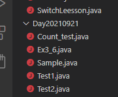
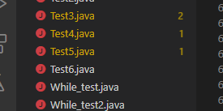
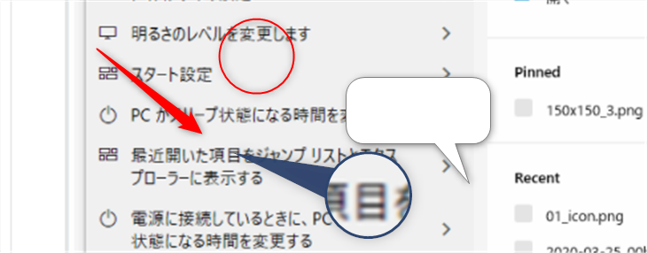

---
tags:
 - markdown
---

# 見出しを作るには#

見出しは大きく表示されるよ

## シャープを増やすと小見出しになるよ
シャープは6個まで増やせるよ

# リスト表示
## 箇条書きリスト
- リスト１
- リスト２
    - リストＩＮリスト１
    - リストＩＮリスト２

- リスト３

## 順番リスト
1. python
2. java
3. javascript
4. C


# リンク
[yahoo](http://yahoo.co.jp)

直かっこ丸括弧

# 画像貼り付け


win + shift + s コピー  
ctl + alt + v vscodeに貼り付け


  


# ソースコード
### インライン
文字列から整数への変換は
`Integer.perseInt()`
を使います

### 複数行

```java
public class Test{
    public static void main
}
```

# その他
*斜体*斜めになるよ  
**太字**になるよ  
~~訂正線~~訂正できるよ

水平線引けるよ
---
---

# test

| name | blood |  
|-|-|  
| name | blood |  

|name|blood|
|-|-|



```java
public class Main{
    public static void main
}
```



