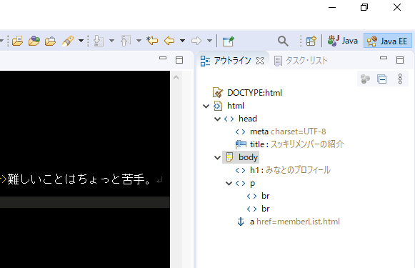
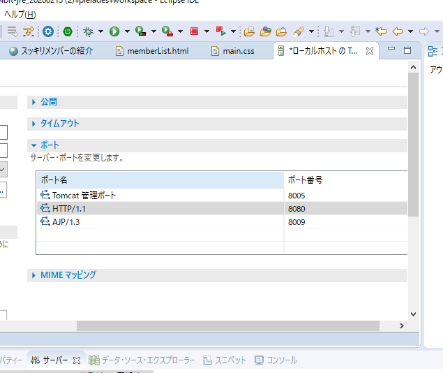
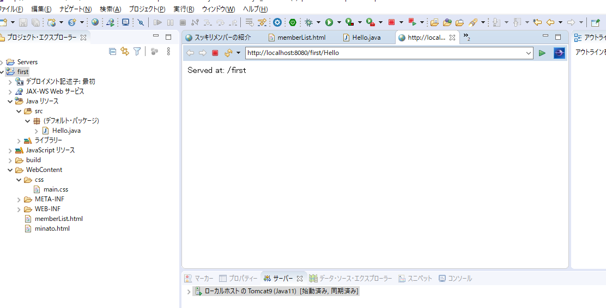
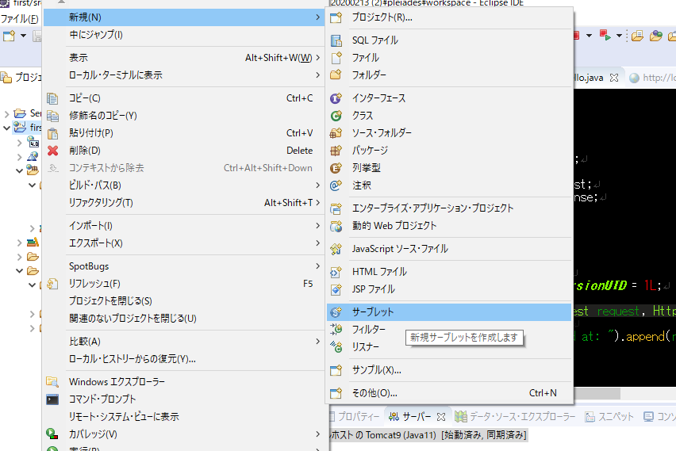

---
tags:
 - java
 - eclipse
 - java EE
---

１．ジャバでＷｅｂの開発
①javaEEを立てる
ウィンドウ
パースペクティブ
パースペクティブを開く
javaEE

②サーバーを立ち上げる
ウィンドウ
ビューの表示
サーバーを右クリック
再開

③インターネットでみる
ローカルーサーバへのアクセス
http://localhost:8080/first/minato.html
ＬＡＮ内のサーバへのアクセス
http://192.168.2.109:8080/first/minato.html
http://192.168.2.101:8080/first/minato.html

ipアドレスはcmdからipconfig

ローカルホストは自分自身を表し以下を意味する。名前解決。
127.0.0.1:8080
※8080自分を表すポート番号。エクリプスにデフォルト設定されてる。サーバーでダブルクリックするとみえる。
httpは80

２．インストール更新を停止
ウィンドウ
設定
インストール／更新
自動更新
自動更新に新規更新を検索して通知

３．サーブレット

・新規プロジェクトをつくる方法
ファイルをクリックして新規
動的Ｗｅｂプロジェクトをクリック

以下がＵＲＬになる
@WebServlet("/Hello2")

3*8=24Mozilla/5.0 (Windows NT 10.0; Win64; x64) AppleWebKit/537.36 (KHTML, like Gecko) Chrome/95.0.4638.69 Safari/537.36

以下は偽装情報。サファリじゃないと表示させないサイトがあるのでブラウザ側にて設定してる
Safari/537.36