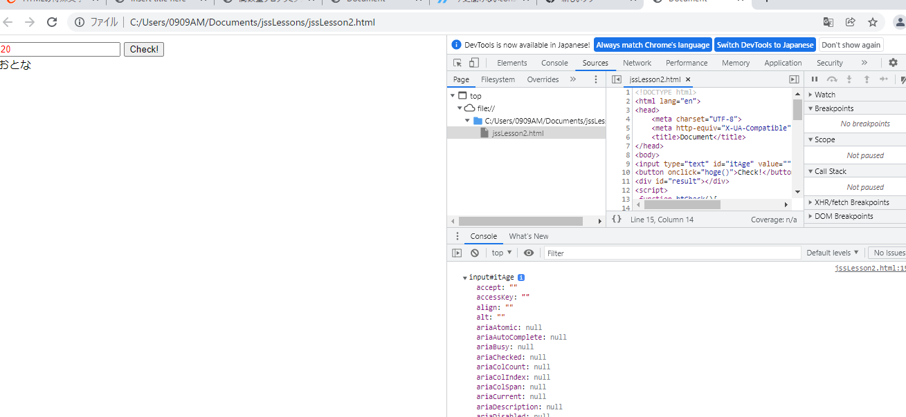
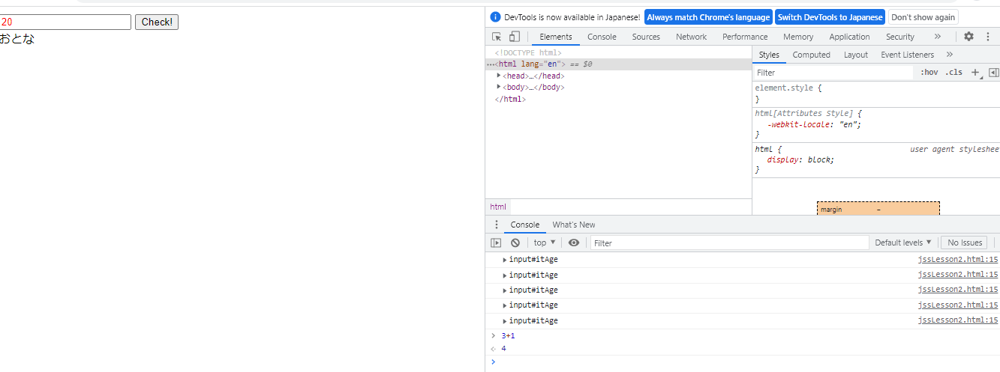

---
tags:
 - javascript
 - scope
---

## console.dirは、縦のログを出力。json方式で出力。

```javascript

     console.dir(itAge);

```





## google検証ツールのconsoleで直接javascriptを実行できる




## var ファンクションスコープ、let ブロックスコープ、const ブロックスコープ
